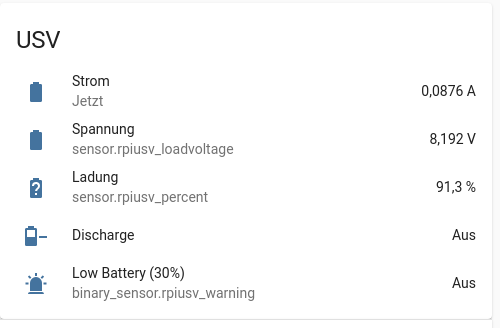

Simple Monitor for waveshare ups hat
====================================

A service that will check the status of an [waveshare ups hat](https://www.waveshare.com/wiki/UPS_HAT) and provide this at a rest API.
It is using the [waveshare example code](https://www.waveshare.com/w/upload/d/d9/UPS_HAT.7z).

Just build a package using buildPkg.sh and install it on the Pi.
Call
```
sudo systemctl enable --now usvwatcher
```
Afterwards you can access the json api
```
    curl localhost:8082 | json_pp
```
You will get an output like:
```
{
   "current" : -0.3938,
   "discharging" : true,
   "loadVoltage" : 8.076,
   "percent" : 86.5,
   "power" : 3.402,
   "psuVoltage" : 8.03662,
   "shuntVoltage" : -0.03938,
   "status" : "OK",
   "timestamp" : 1643572955.18301
}

```
By default the service is set up to shutdown the system if the battery level is below 20%. You can change this in the service file.

Home Assistant Integration
--------------------------
The major intent was to integrate this with [home assistant](https://www.home-assistant.io/)
To utilize the values there just define a [RESTful](https://www.home-assistant.io/integrations/rest/) setup.

Example:
```
rest:
    - scan_interval: 10
      resource: http://localhost:8082/usv
      sensor:
        - name: "RpiUSV_current"
          value_template: '{{ value_json.current | round(4) }}' 
          unit_of_measurement: 'A'
        - name: "RpiUSV_loadVoltage"
          value_template: '{{ value_json.loadVoltage | round(4)}}'
          unit_of_measurement: 'V'
        - name: "RpiUSV_power"
          value_template:> '{{ value_json.power | round(2)}}'    
          unit_of_measurement: 'W'
        - name: "RpiUSV_percent"
          value_template: '{{ value_json.percent | round(1) }}'
          unit_of_measurement: "%"
      binary_sensor:    
        - name: "RpiUSV_discharge"
          value_template:  '{{ value_json.discharging }}'
        - name: "RpiUSV_warning"
          value_template: '{{ True if value_json.percent < 30 }}'
```
You can add a card to your UI:

